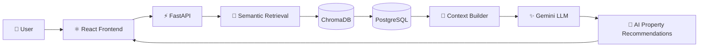
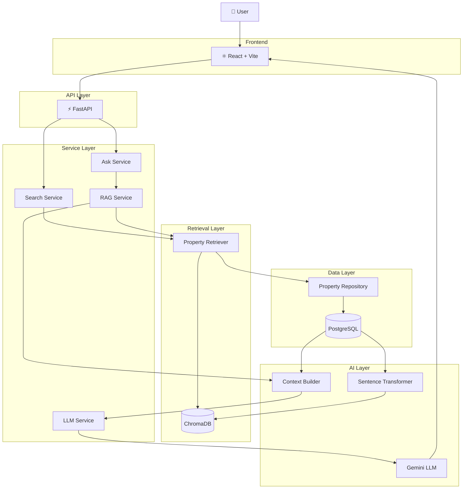
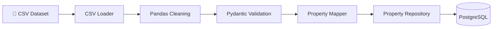
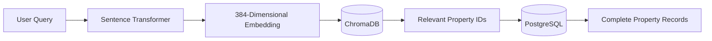
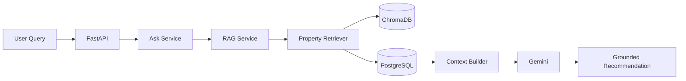
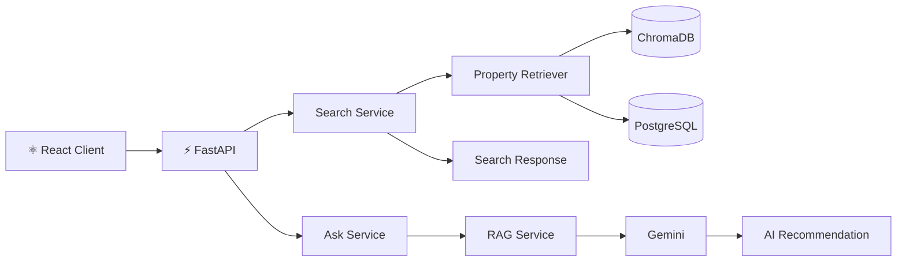
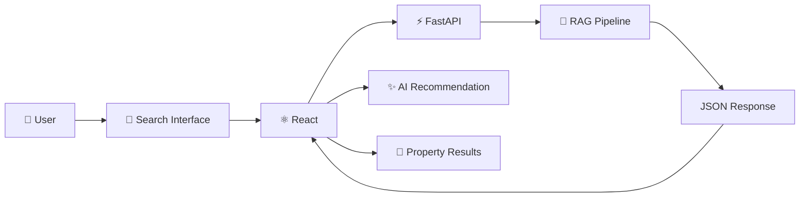

# 🏡 HomeLens

### Find the right property.

> An AI-powered real estate search engine that understands what you're looking for in natural language.

HomeLens is a full-stack AI real estate search engine built from scratch using modern backend, retrieval, RAG, and frontend engineering practices.

Instead of relying only on traditional keyword-based filtering, HomeLens combines **semantic search, vector retrieval, PostgreSQL, and Retrieval-Augmented Generation (RAG)** to understand natural-language property requirements and generate grounded property recommendations.

---

# ✨ HomeLens V1

## Version 1.0 — Complete

HomeLens V1 represents the first complete end-to-end version of the product.

The system can:

- Ingest structured real estate data
- Validate and persist properties in PostgreSQL
- Generate semantic embeddings
- Store and retrieve vectors using ChromaDB
- Perform semantic property search
- Expose retrieval through FastAPI
- Construct contextual property information
- Use Gemini to generate grounded recommendations
- Serve the AI search experience through a React frontend
- Display AI recommendations and property results through a modern SaaS-style interface

### V1 Product Flow



---

# 🚀 What HomeLens Does

HomeLens allows users to search for properties using natural language rather than relying only on traditional keyword filters.

A user can describe a requirement such as:

> "Luxury villa with jacuzzi and home theatre"

HomeLens converts the query into an embedding and performs semantic retrieval against the property vector index.

The retrieved property IDs are then used to fetch complete property records from PostgreSQL.

The resulting property information is converted into structured context and passed to Gemini through the RAG pipeline.

Gemini then generates a grounded natural-language recommendation based only on the retrieved property information.

### Example

**User Query**

```text
Luxury villa with jacuzzi and home theatre
```

**HomeLens Recommendation**

```text
HL-011 — CAT Road / Treasure Fantasy

4 BHK Villa
4,800 sqft
₹7 Crore

The property explicitly contains both:
- Jacuzzi
- Home theatre
```

HomeLens identifies HL-011 as the strongest match because those features are explicitly present in the available property information.

The LLM is instructed not to invent property features that are not present in the retrieved context.

---

# 🧠 System Design

HomeLens follows a layered architecture where each component has a clearly defined responsibility.



---

# 🏗️ Architecture Principles

## 1. PostgreSQL is the Source of Truth

PostgreSQL stores the authoritative property records.

It contains structured information such as:

- Property ID
- Property name
- Location
- BHK
- Area
- Price
- Property details
- Property type
- Furnishing information

The application does not treat the vector database as the primary database.

---

## 2. ChromaDB is a Semantic Retrieval Index

ChromaDB stores vector representations of property search text.

It exists to make semantic similarity retrieval possible.

```text
PostgreSQL
    ↓
Source of Truth


ChromaDB
    ↓
Semantic Retrieval Index
```

This allows HomeLens to combine:

**structured persistence + semantic retrieval**

without making the vector database responsible for authoritative property storage.

---

## 3. Retrieval Happens Before Generation

HomeLens does not simply send a user's query directly to an LLM and ask it to invent a recommendation.

Instead:

```text
User Query
    ↓
Semantic Retrieval
    ↓
Relevant Properties
    ↓
Context Construction
    ↓
LLM
    ↓
Grounded Recommendation
```

The LLM operates on retrieved information.

---

## 4. Separation of Responsibilities

Each layer has a specific responsibility.

| Layer | Responsibility |
|---|---|
| React | User interface and interaction |
| FastAPI | HTTP/API boundary |
| Services | Application/business orchestration |
| Property Retriever | Semantic retrieval |
| Repository | Database operations |
| PostgreSQL | Source of truth |
| ChromaDB | Vector retrieval |
| Context Builder | RAG context construction |
| LLM Service | Gemini interaction |

---

# 📥 Data Ingestion Pipeline

Property data starts as structured CSV data and is transformed into validated database records.



### Pipeline

```text
CSV
 ↓
CSV Loader
 ↓
Pandas
 ↓
Pydantic Schema
 ↓
Property Mapper
 ↓
Repository
 ↓
PostgreSQL
```

### Implemented

- CSV ingestion
- Data cleaning
- Data normalization
- Pydantic validation
- Property mapping
- Repository-based persistence
- PostgreSQL storage

---

# 🔎 Semantic Search Architecture

HomeLens uses local embeddings to understand the semantic meaning of user queries and property descriptions.



### Embedding Model

```text
all-MiniLM-L6-v2
```

The model generates **384-dimensional embeddings**.

### Vector Pipeline

```text
Property Search Text
        ↓
Sentence Transformer
        ↓
384-dimensional embedding
        ↓
ChromaDB
```

### Query Pipeline

```text
User Query
        ↓
Sentence Transformer
        ↓
Query Embedding
        ↓
ChromaDB Similarity Search
        ↓
Relevant Property IDs
        ↓
PostgreSQL
        ↓
Complete Property Records
```

---

# 🤔 Why Semantic Search?

Traditional keyword search primarily depends on literal word matching.

For example:

```text
"large luxury house with entertainment features"
```

may not directly match a property containing:

```text
4 BHK villa
home theatre
jacuzzi
garden
```

Semantic embeddings allow HomeLens to compare the meaning of the query with the meaning of the property descriptions.

This allows the system to retrieve conceptually relevant properties even when the exact wording differs.

---

# 🤖 Retrieval-Augmented Generation

HomeLens combines semantic retrieval with generative AI through a RAG pipeline.



### RAG Mental Model

```text
User Query
    ↓
Retrieve relevant properties
    ↓
Fetch complete property records
    ↓
Construct context
    ↓
Send query + context to Gemini
    ↓
Generate grounded recommendation
```

The fundamental separation is:

> **Retrieval finds the information.**

> **The LLM explains and ranks the information.**

---

# 🧩 RAG Components

## Property Retriever

Responsible for:

- Generating/querying semantic representations
- Searching ChromaDB
- Obtaining relevant property IDs
- Fetching complete records from PostgreSQL

---

## Context Builder

Responsible for converting retrieved property records into structured LLM-readable context.

```text
Retrieved Properties
        ↓
Context Builder
        ↓
LLM Context
```

---

## LLM Service

Responsible for communicating with Gemini.

The LLM service is isolated from the retrieval layer so that the underlying model can be replaced without rewriting the retrieval architecture.

---

## RAG Service

Responsible for orchestrating:

```text
Query
 ↓
Retriever
 ↓
Context Builder
 ↓
LLM
 ↓
Answer
```

---

# 🔐 Grounded Generation

HomeLens uses explicit prompting to reduce unsupported property claims.

The LLM is instructed to:

- Use only the provided property context
- Avoid inventing property details
- Identify the strongest match
- Explain why the property matches
- Mention other relevant properties when useful
- State when the available information is insufficient

### Example

Retrieved property:

```text
Property ID: HL-011

Location: CAT Road / Treasure Fantasy

Type: 4 BHK Villa

Size: 4,800 sqft

Price: ₹7 Crore

Features:
- Jacuzzi
- Home theatre
- Garden
- New construction
- North-east corner plot
```

The model can safely explain why this property matches:

```text
"Luxury villa with jacuzzi and home theatre"
```

because those features exist in the retrieved context.

---

# ⚡ FastAPI Architecture

HomeLens exposes the retrieval and RAG capabilities through REST APIs.



---

# 🌐 API Endpoints

## Health Check

```http
GET /health
```

Used to verify that the HomeLens API is running.

---

## Semantic Search

```http
POST /search
```

Example request:

```json
{
  "query": "luxury villa with jacuzzi",
  "n_results": 5
}
```

The endpoint returns semantically relevant property records.

---

## AI Property Search

```http
POST /ask
```

Example request:

```json
{
  "query": "luxury villa with jacuzzi and home theatre",
  "n_results": 5
}
```

Example response:

```json
{
  "query": "luxury villa with jacuzzi and home theatre",
  "answer": "HL-011 is the strongest match...",
  "properties": []
}
```

The response contains:

- Original query
- AI-generated recommendation
- Retrieved property results

---

# ⚛️ React Frontend

HomeLens V1 includes a React-based SaaS-style product interface.

The frontend provides:

- Natural-language property search
- Search suggestions
- Loading states
- Error handling
- AI recommendation display
- Property result cards
- FastAPI integration
- Modern SaaS visual design
- Responsive UI foundation

### Frontend Architecture



---

# 🎨 Product Design

The V1 frontend follows a modern AI/SaaS visual direction.

Design characteristics include:

- Dark interface
- Purple/indigo AI accent
- Large product hero section
- Natural-language search box
- Suggestion chips
- AI recommendation section
- Property result cards
- Loading animation
- Error states
- Clean typography
- Minimal interface

The goal was to make HomeLens feel like a real AI product rather than a backend demo.

---

# 🛠️ Tech Stack

## Backend

| Technology | Purpose |
|---|---|
| Python 3.11+ | Backend language |
| FastAPI | REST API |
| PostgreSQL | Primary database / source of truth |
| SQLAlchemy 2.0 | ORM |
| Pydantic | Data validation and API schemas |
| Pandas | Data processing |
| python-dotenv | Environment configuration |

---

## AI / Retrieval

| Technology | Purpose |
|---|---|
| Sentence Transformers | Local text embeddings |
| `all-MiniLM-L6-v2` | Embedding model |
| ChromaDB | Vector storage and semantic retrieval |
| Google Gemini | LLM generation |
| Google GenAI SDK | Gemini integration |
| RAG | Retrieval-Augmented Generation |
| Context Builder | Grounded context construction |

---

## Frontend

| Technology | Purpose |
|---|---|
| React | UI framework |
| Vite | Frontend tooling |
| JavaScript | Frontend language |
| CSS | UI styling |
| REST API | Backend communication |

---

# 🏗️ Engineering Patterns

HomeLens was intentionally built using software engineering principles instead of putting all functionality into one script.

---

## Repository Pattern

Database operations are encapsulated inside repositories.

```text
Service
   ↓
Repository
   ↓
PostgreSQL
```

This keeps database access separate from business logic.

---

## Mapper Pattern

The Mapper layer converts validated application schemas into SQLAlchemy models.

```text
Pydantic Schema
      ↓
Property Mapper
      ↓
SQLAlchemy Model
```

---

## Layered Architecture

```text
API Layer
    ↓
Service Layer
    ↓
Retrieval / Repository Layer
    ↓
Database / Vector Store
```

This separation makes components easier to understand, test, replace, and extend.

---

# 🧩 Separation of Responsibilities

| Component | Responsibility |
|---|---|
| React | UI and user interaction |
| FastAPI | HTTP/API boundary |
| Search Service | Search orchestration |
| Ask Service | AI search orchestration |
| RAG Service | Retrieval + generation workflow |
| Property Retriever | Semantic retrieval |
| Repository | PostgreSQL operations |
| PostgreSQL | Source of truth |
| ChromaDB | Vector retrieval |
| Context Builder | LLM context construction |
| LLM Service | Gemini communication |

---

# 📈 Development Journey

HomeLens was developed incrementally through engineering sprints.

---

# Sprint 1 — Project Setup

### ✅ Completed

- Project structure
- Python environment
- Configuration
- Git repository
- Development workflow

---

# Sprint 2 — CSV Processing & Validation

### ✅ Completed

- CSV ingestion
- Pandas processing
- Pydantic schemas
- Data validation
- Property normalization
- Structured property representation

---

# Sprint 3 — PostgreSQL + SQLAlchemy ORM

### ✅ Completed

- PostgreSQL database
- SQLAlchemy 2.0
- ORM models
- Database persistence
- Property storage

---

# Sprint 4 — Repository Layer & Layered Architecture

### ✅ Completed

- Repository Pattern
- `PropertyRepository`
- Mapper Pattern
- Layered architecture
- Database abstraction
- Separation of ingestion and persistence logic
- Successfully persisted real estate listings into PostgreSQL

### Architecture

```text
CSV
 ↓
CSV Loader
 ↓
Pydantic Schema
 ↓
Property Mapper
 ↓
Repository
 ↓
PostgreSQL
```

---

# Sprint 5 — Embeddings & Semantic Retrieval

### ✅ Completed

- Local embedding generation
- Sentence Transformers
- `all-MiniLM-L6-v2`
- 384-dimensional embeddings
- Persistent ChromaDB storage
- Vector indexing
- Metadata storage
- Semantic similarity search
- Idempotent vector indexing using `upsert`
- PostgreSQL + ChromaDB retrieval
- End-to-end semantic property retrieval

### Semantic Search Architecture

```text
User Query
 ↓
Embedding Model
 ↓
ChromaDB
 ↓
Relevant Property IDs
 ↓
PostgreSQL
 ↓
Complete Property Records
```

### Key Design Decision

PostgreSQL remains the source of truth.

ChromaDB is used as the semantic retrieval index rather than the primary property database.

---

# Sprint 6 — FastAPI Retrieval API

### ✅ Completed

- FastAPI application
- `/health` endpoint
- `POST /search`
- Pydantic request/response schemas
- `SearchService`
- `PropertyRetriever` integration
- Configurable `n_results`
- REST API-based semantic retrieval

### API Architecture

```text
Client
 ↓
FastAPI
 ↓
SearchService
 ↓
PropertyRetriever
 ↓
ChromaDB
 ↓
PostgreSQL
 ↓
JSON Response
```

---

# Sprint 7 — Retrieval-Augmented Generation

### ✅ Completed

- Gemini LLM integration
- Google GenAI SDK
- Dedicated `LLMService`
- `ContextBuilder`
- `RAGService`
- `AskService`
- Grounded prompting
- `POST /ask`
- `AskResponse` schema
- End-to-end RAG testing

### RAG Architecture

```text
User Query
 ↓
FastAPI
 ↓
AskService
 ↓
RAGService
 ↓
PropertyRetriever
 ↓
ChromaDB
 ↓
PostgreSQL
 ↓
ContextBuilder
 ↓
Gemini
 ↓
Natural-Language Recommendation
```

---

# Sprint 8 — React Product Interface

### ✅ Completed

- React application
- Vite setup
- HomeLens product homepage
- Natural-language search
- Search suggestion chips
- FastAPI integration
- Loading states
- Error states
- AI recommendation display
- Property result rendering
- Modern SaaS UI
- End-to-end frontend → backend → AI integration

### Frontend Flow

```text
User
 ↓
React Search Box
 ↓
POST /ask
 ↓
FastAPI
 ↓
RAG Pipeline
 ↓
Gemini
 ↓
JSON Response
 ↓
React
 ↓
AI Recommendation + Property Cards
```

---

# 🏁 HomeLens V1 — COMPLETE

## Version 1.0

HomeLens V1 is considered the first complete end-to-end version of the product.

```text
┌────────────────────────────────────────────┐
│              🏡 HomeLens V1                │
│                                            │
│  Data Ingestion              ✅            │
│  Data Validation             ✅            │
│  PostgreSQL                  ✅            │
│  SQLAlchemy                  ✅            │
│  Repository Pattern          ✅            │
│  Embeddings                  ✅            │
│  ChromaDB                    ✅            │
│  Semantic Search             ✅            │
│  FastAPI                     ✅            │
│  RAG                         ✅            │
│  Gemini                      ✅            │
│  React                       ✅            │
│  AI Search UI                ✅            │
│                                            │
│       🚀 V1 PRODUCT COMPLETE              │
└────────────────────────────────────────────┘
```

V1 is intentionally considered complete.

Future debugging, ranking improvements, UX improvements, infrastructure work, and additional AI capabilities will be developed as subsequent versions rather than being treated as blockers for V1.

---

# 🔮 Future Roadmap

The following capabilities are intentionally outside the V1 scope.

---

## V1.1 — Search Intelligence

Potential improvements:

- Geographic distance-aware ranking
- Structured filtering
- Price-aware ranking
- BHK-aware ranking
- Hybrid semantic + structured retrieval
- Better query understanding
- Improved reranking
- Query decomposition
- Better location understanding
- Better handling of budget constraints
- More precise property ranking

---

# V2 — Production Infrastructure

Planned:

- Dockerization
- Production configuration
- Cloud deployment
- CI/CD
- Monitoring
- Logging
- Environment management
- Production database configuration
- API security
- Authentication
- OAuth
- Rate limiting
- Production observability

Authentication and OAuth are intentionally deferred because the V1 objective was to complete the core AI product pipeline first.

---

# V3 — Multimodal Real Estate Search

Planned:

- Property image understanding
- Image + text search
- Multimodal embeddings
- Visual property discovery
- Image-based property recommendations
- Property image similarity search
- Natural-language + visual search

---

# ☁️ Deployment

HomeLens V1 currently focuses on completing the product and AI engineering foundation.

Cloud deployment is planned as a subsequent engineering phase.

Potential deployment targets include:

- Google Cloud Platform
- AWS

The deployment architecture will be designed separately from the local V1 architecture.

Potential production architecture:

```text
                    ┌───────────────────┐
                    │   React Frontend  │
                    └─────────┬─────────┘
                              │
                              ▼
                    ┌───────────────────┐
                    │   Cloud / CDN     │
                    └─────────┬─────────┘
                              │
                              ▼
                    ┌───────────────────┐
                    │   FastAPI Backend │
                    └─────────┬─────────┘
                              │
                ┌─────────────┴─────────────┐
                ▼                           ▼
        ┌───────────────┐          ┌───────────────┐
        │  PostgreSQL   │          │   ChromaDB /  │
        │               │          │ Vector Store  │
        └───────────────┘          └───────────────┘
                             
                              │
                              ▼
                       ┌─────────────┐
                       │ Gemini API  │
                       └─────────────┘
```

---

# 🔐 Security

Sensitive configuration is stored using environment variables.

Example:

```env
GEMINI_API_KEY=your_api_key
DATABASE_URL=your_database_url
```

Secrets should never be committed to Git.

Sensitive files are excluded through `.gitignore`.

Future production security work will include:

- Authentication
- OAuth
- API authorization
- Rate limiting
- Secret management
- HTTPS
- CORS configuration
- Production database security
- Monitoring and auditing

---

# 📂 Project Structure

```text
HomeLens/
│
├── app/
│   │
│   ├── api/
│   │
│   ├── models/
│   │
│   ├── repositories/
│   │   └── property_repository.py
│   │
│   ├── schemas/
│   │   └── search.py
│   │
│   ├── services/
│   │   ├── context_builder.py
│   │   ├── llm_service.py
│   │   ├── property_retriever.py
│   │   ├── rag_service.py
│   │   ├── search_service.py
│   │   └── ask_service.py
│   │
│   └── main.py
│
├── data/
│
├── frontend/
│   │
│   ├── src/
│   │   ├── components/
│   │   ├── services/
│   │   ├── App.jsx
│   │   ├── App.css
│   │   └── main.jsx
│   │
│   ├── package.json
│   └── vite.config.js
│
├── tests/
│
├── requirements.txt
├── .gitignore
└── README.md
```

---

# 🧪 Example End-to-End Request

```text
User
 │
 │ "Luxury villa with jacuzzi and home theatre"
 ▼
React Search Interface
 │
 ▼
POST /ask
 │
 ▼
FastAPI
 │
 ▼
AskService
 │
 ▼
RAGService
 │
 ▼
PropertyRetriever
 │
 ├──────────────► ChromaDB
 │                   │
 │                   ▼
 │             Relevant IDs
 │
 └──────────────► PostgreSQL
                     │
                     ▼
              Complete Records
                     │
                     ▼
              Context Builder
                     │
                     ▼
                  Gemini
                     │
                     ▼
          Grounded Recommendation
                     │
                     ▼
                 React UI
```

---

# 💡 What I Learned Building HomeLens

HomeLens was built as an engineering project rather than simply a collection of AI libraries.

The project provided hands-on experience with:

### Backend Engineering

- Backend architecture
- REST API design
- FastAPI
- PostgreSQL
- SQLAlchemy
- Repository Pattern
- Mapper Pattern
- Layered architecture
- Data validation
- Service-layer design

### AI Engineering

- Embeddings
- Vector databases
- ChromaDB
- Semantic search
- Retrieval-Augmented Generation
- Prompt engineering
- LLM integration
- Context construction
- Grounded generation

### Frontend Engineering

- React
- Components
- Props
- State
- Hooks
- Rendering
- API integration
- Loading and error states
- SaaS UI design

### System Design

- Source-of-truth architecture
- Vector retrieval architecture
- Retrieval vs generation separation
- Service orchestration
- Backend/frontend separation
- AI application architecture

The goal was to understand **how the pieces work together**, rather than simply learning how to call individual libraries.

---

# 🎯 Engineering Goals

HomeLens was designed around several core principles.

## 1. Retrieval Before Generation

The LLM should work with retrieved information rather than independently inventing property data.

```text
Retrieve
   ↓
Context
   ↓
Generate
```

---

## 2. Structured Data Remains Authoritative

PostgreSQL remains the source of truth.

ChromaDB supports semantic retrieval but does not replace the relational database.

```text
PostgreSQL
     │
     ├── Structured truth
     │
     ▼
ChromaDB
     │
     └── Semantic retrieval
```

---

## 3. AI is Part of an Engineered System

The LLM is treated as one component inside a larger software system.

```text
Data
 ↓
Validation
 ↓
Persistence
 ↓
Embeddings
 ↓
Retrieval
 ↓
Context
 ↓
LLM
 ↓
Application
```

---

## 4. Separation of Concerns

Each component should have a clear responsibility.

The project avoids coupling:

- API logic
- Database logic
- Retrieval logic
- LLM logic
- Frontend logic

into a single implementation.

---

# 🧠 HomeLens Engineering Philosophy

HomeLens is not intended to be just an "LLM wrapper."

The objective is to build an AI application where:

```text
Traditional Backend Engineering
              +
        Data Engineering
              +
       Retrieval Systems
              +
         AI / RAG
              +
       Frontend Product
              =
       AI Application
```

The project therefore focuses on understanding the engineering surrounding AI systems, not only the model API itself.

---

# 📌 Current V1 Scope

HomeLens V1 intentionally focuses on:

```text
Structured Property Data
        ↓
PostgreSQL
        ↓
Embeddings
        ↓
ChromaDB
        ↓
Semantic Retrieval
        ↓
RAG
        ↓
Gemini
        ↓
FastAPI
        ↓
React
        ↓
AI Property Search Product
```

Features such as authentication, OAuth, advanced ranking, production infrastructure, multimodal search, and large-scale deployment are intentionally deferred to later versions.

---

# 👩‍💻 Built By

## Krati Bhatia

AI / Backend Engineer building practical AI systems from the ground up.

HomeLens was built as a hands-on engineering project to understand how modern AI applications are designed across:

**Backend → Retrieval → RAG → LLM → Frontend → Product**

---

# 🏡 HomeLens

### Find the right property.

**Version 1.0 — Complete 🚀**

Built with:

**Python · FastAPI · PostgreSQL · SQLAlchemy · ChromaDB · Sentence Transformers · Gemini · React · Vite**

---

<p align="center">

**HomeLens V1**

*An AI-powered real estate search engine.*

### Find the right property.

</p>